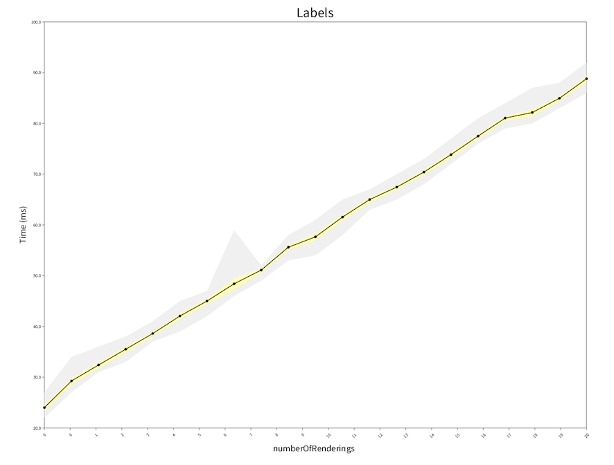

# RS3Benchmarks
Benchmark suites to profile performance of [Roassal3](https://github.com/objectprofile/roassal3).

This project uses https://github.com/smarr/SMark to run and report benchmarks.

## Installation
First, load Roassal3.

```Smalltalk
Metacello new
	baseline: 'Roassal3';
	repository: 'github://ObjectProfile/Roassal3';
	load.
```

Second, load the benchmarks.
```Smalltalk
Metacello new
	baseline: 'RS3Benchmarks';
	repository: 'github://tinchodias/RS3Benchmarks';
	load
```

Note Roassal3 is not added as a dependency on purpose. The intention is to avoid loading confusions when benchmarking multiple versions of Roassal3. This way, the user will explicitly choose which version is being measured.

## How to use

### Visual version

Evaluate:

```Smalltalk
RSBenchChartBuilder exampleForceBasedLayout
```

And a window will show up, something like:




### Text version

Evaluate:

```Smalltalk
RSLabelBenchs new runOnNumberOfRenderings
```

You will find a series of reports like this on Transcript:

```
a SmallDictionary(#numberOfLabels->100 #numberOfRenderings->0 #layoutSelector->#applyForceBasedLayout:)
Report for: RSLabelBenchs
Benchmark Labels
Labels total: iterations=10 runtime: 347.10ms +/-0.83
```

The first line shows the parameters of that benchmark run (100 labels, 0 renderings, force based layout).

## License
The code is licensed under [MIT](LICENSE).
